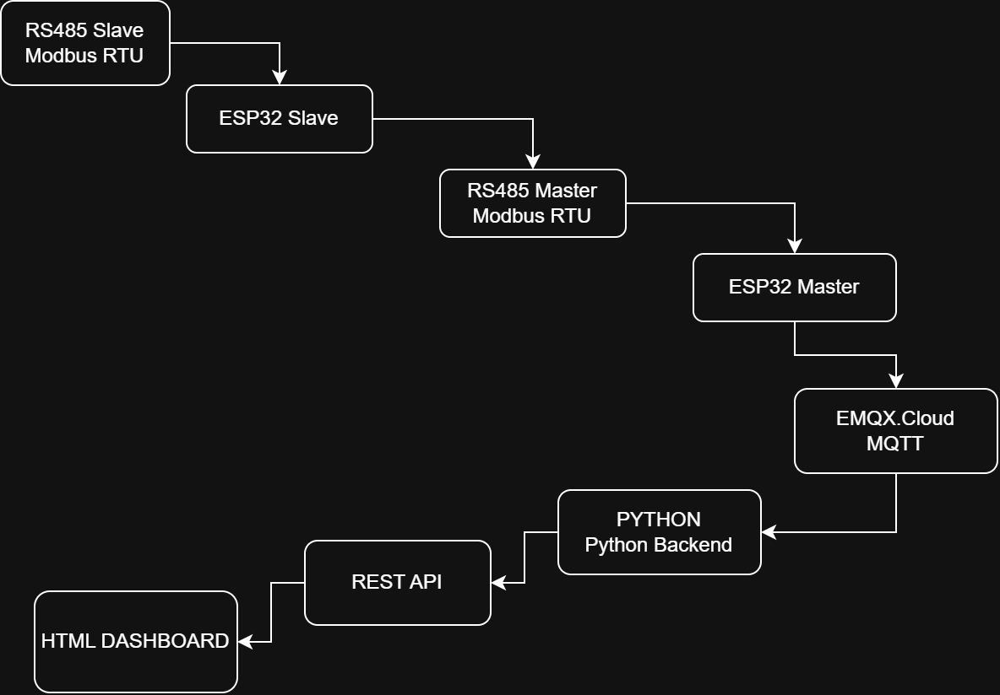
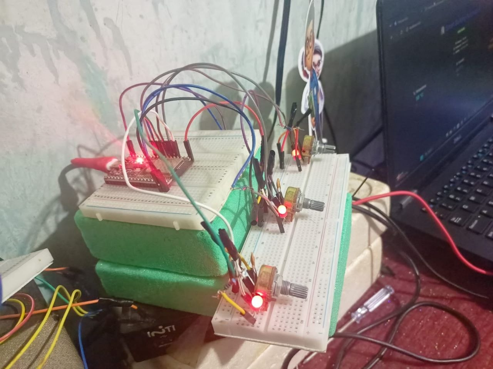
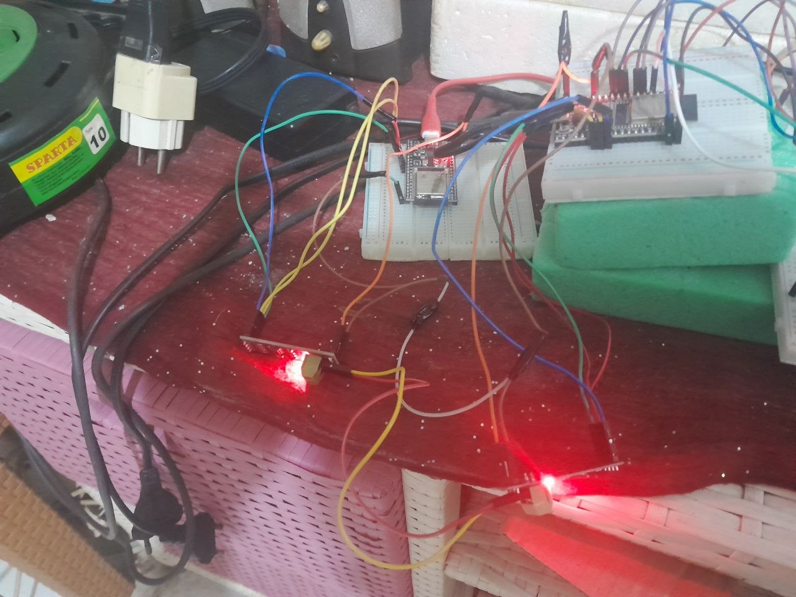
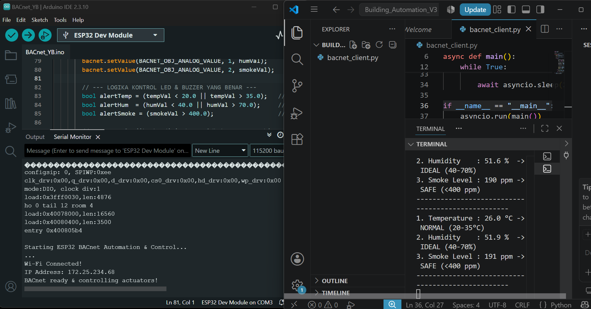
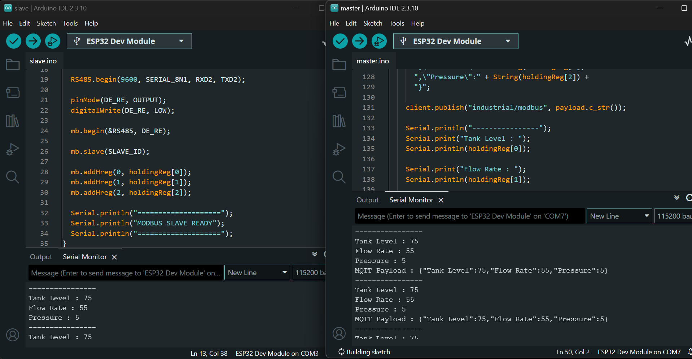
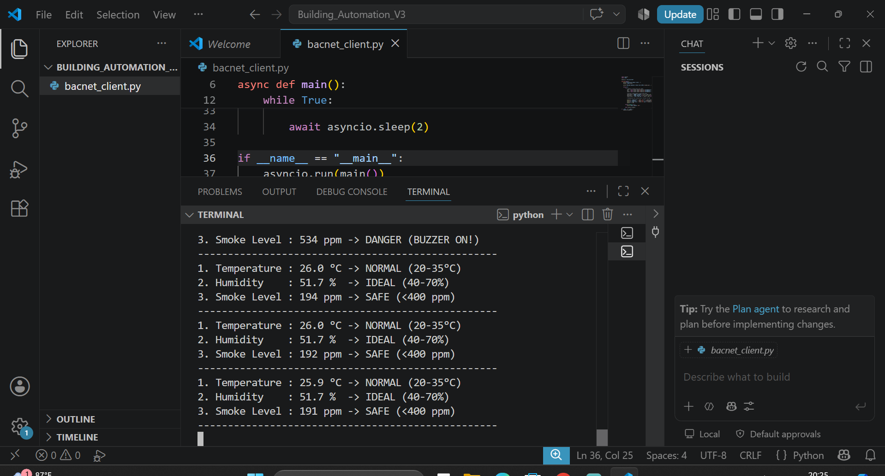
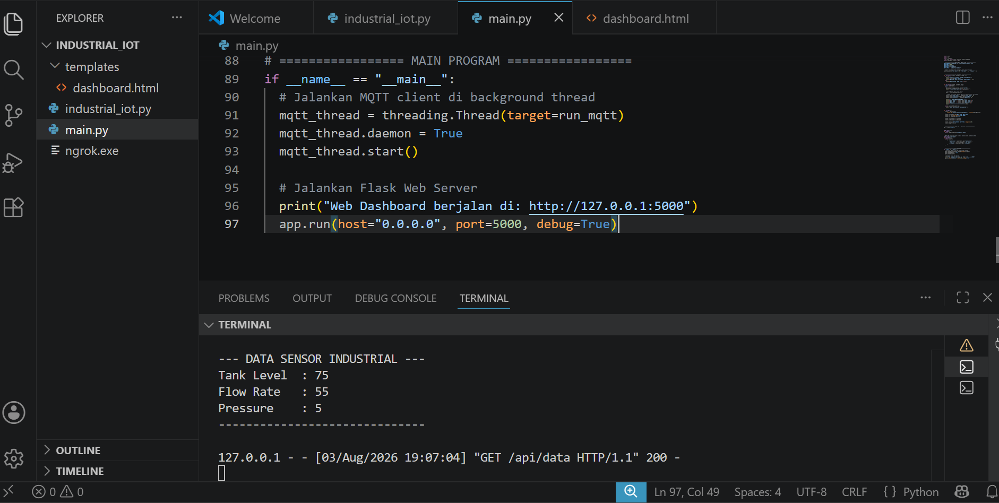
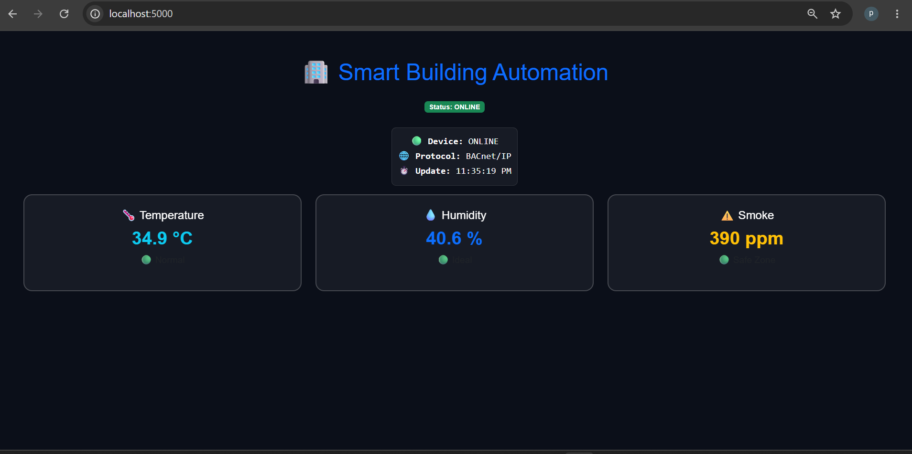
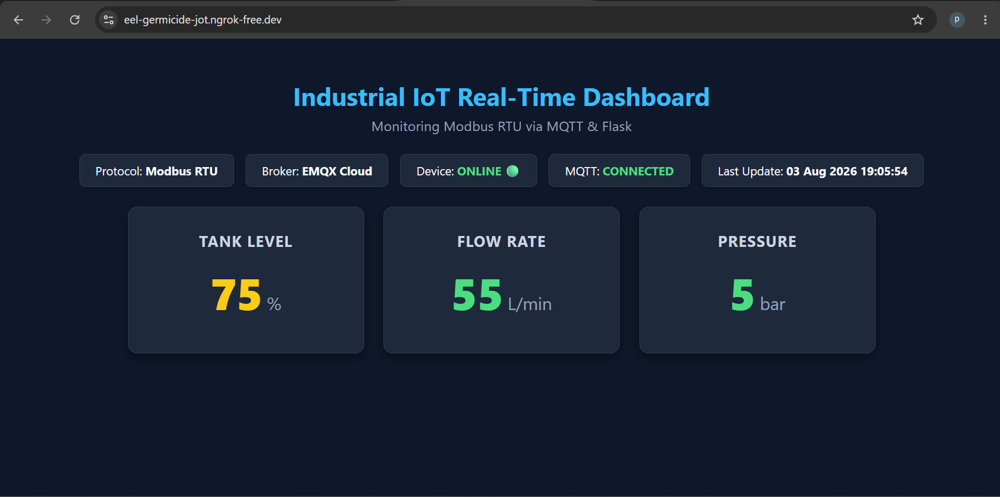

# 🏢 Smart Building Automation System

Industrial Building Automation System using ESP32, Modbus RTU Master-Slave, BACnet/IP, Python BAC0, Flask REST API, MQTT, and Real-Time Web Dashboard.

This project demonstrates two Industrial IoT communication protocols:

- Modbus RTU Master-Slave for industrial device communication over RS485.
- BACnet/IP for Building Management System (BMS) monitoring.

The collected data is processed by a Python backend, exposed through a Flask REST API, and displayed on a responsive real-time web dashboard.

---

## 🚀 Features

### Modbus RTU

- ESP32 Modbus RTU Slave
- ESP32 Modbus RTU Master
- RS485 Communication
- MQTT (EMQX Cloud)
- Python MQTT Backend
- Flask REST API
- HTML Web Dashboard

### BACnet/IP

- ESP32 BACnet/IP Device
- Python BAC0 Backend
- Flask REST API
- HTML Web Dashboard
- Remote Access using Ngrok

---

## 🏗️ System Architecture

---

## 🛠️ Hardware

- ESP32 x2 (Modbus RTU Master & Slave)
- ESP32 x1 (BACnet/IP)
- RS485 Module x2
- 3 Potentiometers
- 3 LEDs
- Buzzer

---

## 💻 Software

- Arduino IDE
- Python
- BAC0
- Paho MQTT
- Flask
- HTML
- CSS
- JavaScript
- EMQX Cloud

----

### BACnet/IP Arduino Firmware

### Modbus RTU Master-Slave Arduino Firmware

### BACnet/IP Python Backend

### Modbus RTU Python Backend

## 📊 Web Dashboard

### Smart Building Dashboard (BACnet/IP)

### Modbus RTU Dashboard

## 🎥 Demo Videos

## BACnet/IP & Building Management System (BMS)

https://drive.google.com/file/d/11mO285U_dFR2Ylb10e1jOSJIQ3AvuQ_X/view?usp=drivesdk

- ESP32 BACnet/IP Communication
- Sensor Monitoring
- Alarm & Buzzer
- Web Dashboard
  

---

## Modbus RTU Master-Slave & Industrial Communication

https://drive.google.com/file/d/1Dtl5ihOFRqXYLLQfXnsoSor2hZmqA7pN/view?usp=drivesdk

- ESP32 Master → Slave Communication
- RS485 Data Exchange
- Register Read/Write
- Industrial Automation Demo

## 👨‍💻 Author

Marwan Saputra

Junior Industrial IoT & Embedded Systems Engineer

GitHub:
https://github.com/Marwan-git28

LinkedIn:
https://www.linkedin.com/in/marwan-saputra-972242415/
